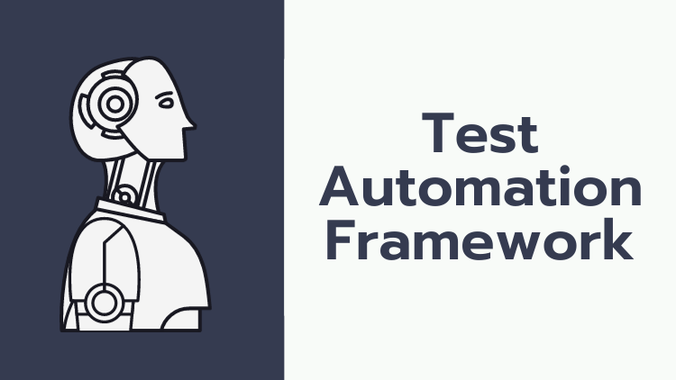

# Test Automation Framework using Spring

The aim of this repo not to share the "actual framework" which anyone can clone and use it. Instead it contains sample code to demonstare Spring features and how it can be utilized for Selenium Test Automation framework creation on your own.

Checkout this [Udemy course](https://www.udemy.com/course/cucumber-with-spring-boot/).

